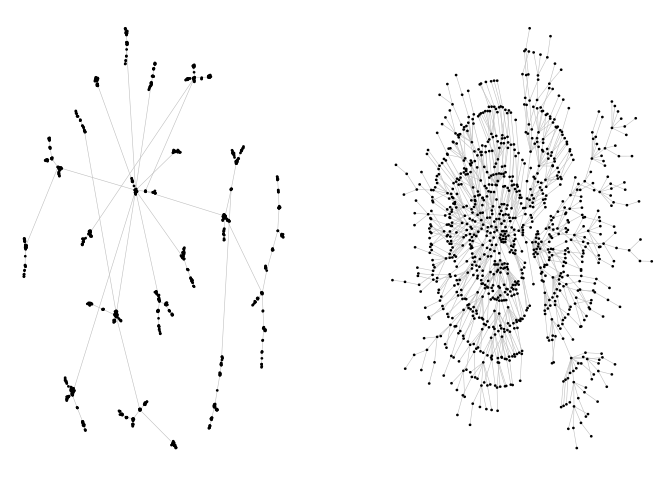

<!-- README.md is generated from README.Rmd. Please edit that file -->
smglr
=====

smglr stands for **S**tress **M**ajorization **G**raph **L**ayout in R.

Example
-------

``` r
library(igraph)   
library(ggraph)   
library(patchwork)
# devtools::install_github("schochastics/smglr")
library(smglr)

pa <- sample_pa(1000,1,1,directed = F)

ggraph(pa)+
  geom_edge_link(width=0.2,colour="grey")+
  geom_node_point(col="black",size=0.3)+
  theme_graph() -> p1


l <- stress_majorization(pa)
ggraph(pa,layout="manual",node.positions=data.frame(x=l[,1],y=l[,2]))+
  geom_edge_link(width=0.2,colour="grey")+
  geom_node_point(col="black",size=0.3)+
  theme_graph()-> p2

p1+p2
```



Also see the dedicated [blog post](http://blog.schochastics.net/post/stress-based-graph-layouts/) for more information.
