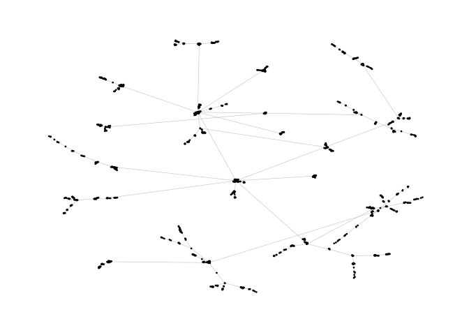
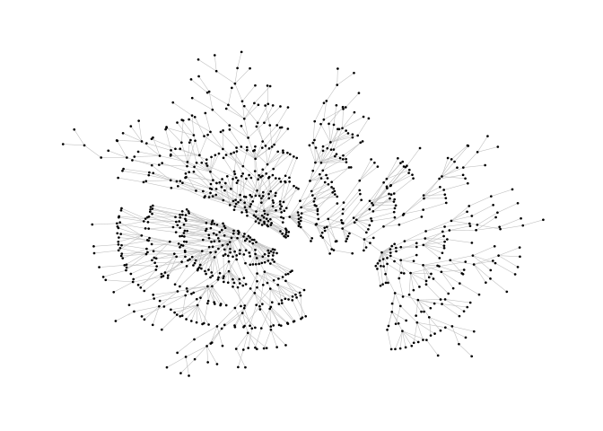
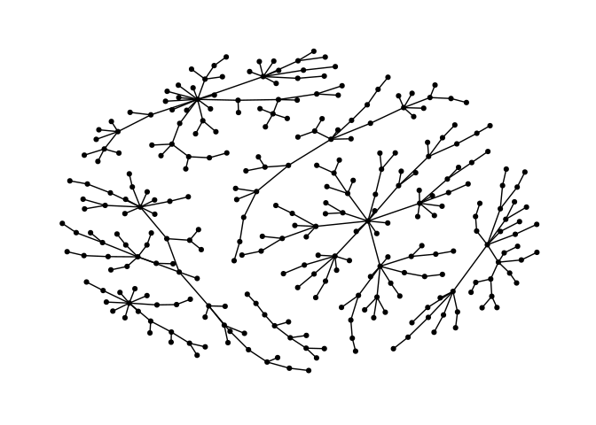
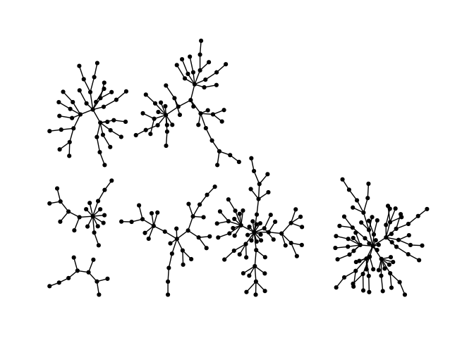
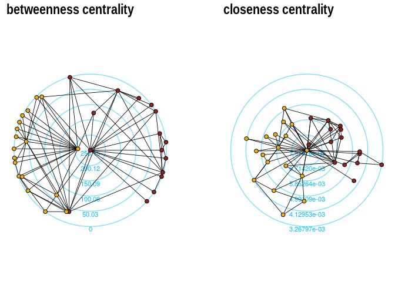

<!-- README.md is generated from README.Rmd. Please edit that file -->

# graphlayouts 

[](https://github.com/schochastics/graphlayouts/actions)
[](https://cran.r-project.org/package=graphlayouts)
[](https://CRAN.R-project.org/package=graphlayouts)
[](https://CRAN.R-project.org/package=graphlayouts)
[](https://app.codecov.io/gh/schochastics/graphlayouts?branch=main)
[](https://doi.org/10.5281/zenodo.7870213)
[](https://doi.org/10.21105/joss.05238)

This package implements some graph layout algorithms that are not
available in `igraph`.

**A detailed introductory tutorial for graphlayouts and ggraph can be
found [here](https://schochastics.github.io/netVizR/).**

The package implements the following algorithms:

- Stress majorization
  ([Paper](https://graphviz.gitlab.io/_pages/Documentation/GKN04.pdf))
- Quadrilateral backbone layout
  ([Paper](https://kops.uni-konstanz.de/entities/publication/3403ae27-3e43-4a7c-9818-4484433fcce8))
- flexible radial layouts
  ([Paper](https://www.uni-konstanz.de/algo/publications/bp-mfrl-11.pdf))
- sparse stress ([Paper](https://arxiv.org/abs/1608.08909))
- pivot MDS
  ([Paper](https://kops.uni-konstanz.de/bitstream/handle/123456789/5741/bp_empmdsld_06.pdf?sequence=1&isAllowed=y))
- dynamic layout for longitudinal data
  ([Paper](https://kops.uni-konstanz.de/bitstream/handle/123456789/20924/Brandes_209246.pdf?sequence=2))
- spectral layouts (adjacency/Laplacian)
- a simple multilevel layout
- a layout algorithm using UMAP
- group based centrality and focus layouts which keeps groups of nodes
  close in the same range on the concentric circle

## Install

``` r
# dev version
remotes::install_github("schochastics/graphlayouts")

# CRAN
install.packages("graphlayouts")
```

## Stress Majorization: Connected Network

*This example is a bit of a special case since it exploits some weird
issues in igraph.*

``` r
library(igraph)
library(ggraph)
library(graphlayouts)

set.seed(666)
pa <- sample_pa(1000, 1, 1, directed = F)

ggraph(pa, layout = "nicely") +
    geom_edge_link0(width = 0.2, colour = "grey") +
    geom_node_point(col = "black", size = 0.3) +
    theme_graph()
```



``` r

ggraph(pa, layout = "stress") +
    geom_edge_link0(width = 0.2, colour = "grey") +
    geom_node_point(col = "black", size = 0.3) +
    theme_graph()
```



## Stress Majorization: Unconnected Network

Stress majorization also works for networks with several components. It
relies on a bin packing algorithm to efficiently put the components in a
rectangle, rather than a circle.

``` r
set.seed(666)
g <- disjoint_union(
    sample_pa(10, directed = FALSE),
    sample_pa(20, directed = FALSE),
    sample_pa(30, directed = FALSE),
    sample_pa(40, directed = FALSE),
    sample_pa(50, directed = FALSE),
    sample_pa(60, directed = FALSE),
    sample_pa(80, directed = FALSE)
)

ggraph(g, layout = "nicely") +
    geom_edge_link0() +
    geom_node_point() +
    theme_graph()
```



``` r

ggraph(g, layout = "stress", bbox = 40) +
    geom_edge_link0() +
    geom_node_point() +
    theme_graph()
```



## Backbone Layout

Backbone layouts are helpful for drawing hairballs.

``` r
set.seed(665)
# create network with a group structure
g <- sample_islands(9, 40, 0.4, 15)
g <- simplify(g)
V(g)$grp <- as.character(rep(1:9, each = 40))

ggraph(g, layout = "stress") +
    geom_edge_link0(colour = rgb(0, 0, 0, 0.5), width = 0.1) +
    geom_node_point(aes(col = grp)) +
    scale_color_brewer(palette = "Set1") +
    theme_graph() +
    theme(legend.position = "none")
```


The backbone layout helps to uncover potential group structures based on
edge embeddedness and puts more emphasis on this structure in the
layout.

``` r
bb <- layout_as_backbone(g, keep = 0.4)
E(g)$col <- FALSE
E(g)$col[bb$backbone] <- TRUE

ggraph(g, layout = "manual", x = bb$xy[, 1], y = bb$xy[, 2]) +
    geom_edge_link0(aes(col = col), width = 0.1) +
    geom_node_point(aes(col = grp)) +
    scale_color_brewer(palette = "Set1") +
    scale_edge_color_manual(values = c(rgb(0, 0, 0, 0.3), rgb(0, 0, 0, 1))) +
    theme_graph() +
    theme(legend.position = "none")
```


## Radial Layout with Focal Node

The function `layout_with_focus()` creates a radial layout around a
focal node. All nodes with the same distance from the focal node are on
the same circle.

``` r
library(igraphdata)
library(patchwork)
data("karate")

p1 <- ggraph(karate, layout = "focus", focus = 1) +
    draw_circle(use = "focus", max.circle = 3) +
    geom_edge_link0(edge_color = "black", edge_width = 0.3) +
    geom_node_point(aes(fill = as.factor(Faction)), size = 2, shape = 21) +
    scale_fill_manual(values = c("#8B2323", "#EEAD0E")) +
    theme_graph() +
    theme(legend.position = "none") +
    coord_fixed() +
    labs(title = "Focus on Mr. Hi")

p2 <- ggraph(karate, layout = "focus", focus = 34) +
    draw_circle(use = "focus", max.circle = 4) +
    geom_edge_link0(edge_color = "black", edge_width = 0.3) +
    geom_node_point(aes(fill = as.factor(Faction)), size = 2, shape = 21) +
    scale_fill_manual(values = c("#8B2323", "#EEAD0E")) +
    theme_graph() +
    theme(legend.position = "none") +
    coord_fixed() +
    labs(title = "Focus on John A.")

p1 + p2
```


## Radial Centrality Layout

The function `layout_with_centrality` creates a radial layout around the
node with the highest centrality value. The further outside a node is,
the more peripheral it is.

``` r
library(igraphdata)
library(patchwork)
data("karate")

bc <- betweenness(karate)
p1 <- ggraph(karate, layout = "centrality", centrality = bc, tseq = seq(0, 1, 0.15)) +
    draw_circle(use = "cent") +
    annotate_circle(bc, format = "", pos = "bottom") +
    geom_edge_link0(edge_color = "black", edge_width = 0.3) +
    geom_node_point(aes(fill = as.factor(Faction)), size = 2, shape = 21) +
    scale_fill_manual(values = c("#8B2323", "#EEAD0E")) +
    theme_graph() +
    theme(legend.position = "none") +
    coord_fixed() +
    labs(title = "betweenness centrality")


cc <- closeness(karate)
p2 <- ggraph(karate, layout = "centrality", centrality = cc, tseq = seq(0, 1, 0.2)) +
    draw_circle(use = "cent") +
    annotate_circle(cc, format = "scientific", pos = "bottom") +
    geom_edge_link0(edge_color = "black", edge_width = 0.3) +
    geom_node_point(aes(fill = as.factor(Faction)), size = 2, shape = 21) +
    scale_fill_manual(values = c("#8B2323", "#EEAD0E")) +
    theme_graph() +
    theme(legend.position = "none") +
    coord_fixed() +
    labs(title = "closeness centrality")

p1 + p2
```



## Large graphs

`graphlayouts` implements two algorithms for visualizing large networks
(\<100k nodes). `layout_with_pmds()` is similar to `layout_with_mds()`
but performs the multidimensional scaling only with a small number of
pivot nodes. Usually, 50-100 are enough to obtain similar results to the
full MDS.

`layout_with_sparse_stress()` performs stress majorization only with a
small number of pivots (~50-100). The runtime performance is inferior to
pivotMDS but the quality is far superior.

A comparison of runtimes and layout quality can be found in the
[wiki](https://github.com/schochastics/graphlayouts/wiki/)  
**tl;dr**: both layout algorithms appear to be faster than the fastest
igraph algorithm `layout_with_drl()`.

Below are two examples of layouts generated for large graphs using
`layout_with_sparse_stress()`


A retweet network with 18k nodes and 61k edges


A network of football players with 165K nodes and 6M edges.

## dynamic layouts

`layout_as_dynamic()` allows you to visualize snapshots of longitudinal
network data. Nodes are anchored with a reference layout and only moved
slightly in each wave depending on deleted/added edges. In this way, it
is easy to track down specific nodes throughout time. Use `patchwork` to
put the individual plots next to each other.

``` r
# remotes::install_github("schochastics/networkdata")
library(networkdata)
# longitudinal dataset of friendships in a school class
data("s50")

xy <- layout_as_dynamic(s50, alpha = 0.2)
pList <- vector("list", length(s50))

for (i in seq_along(s50)) {
    pList[[i]] <- ggraph(s50[[i]], layout = "manual", x = xy[[i]][, 1], y = xy[[i]][, 2]) +
        geom_edge_link0(edge_width = 0.6, edge_colour = "grey66") +
        geom_node_point(shape = 21, aes(fill = as.factor(smoke)), size = 3) +
        geom_node_text(aes(label = 1:50), repel = T) +
        scale_fill_manual(
            values = c("forestgreen", "grey25", "firebrick"),
            labels = c("no", "occasional", "regular"),
            name = "smoking",
            guide = ifelse(i != 2, "none", "legend")
        ) +
        theme_graph() +
        theme(legend.position = "bottom") +
        labs(title = paste0("Wave ", i))
}
wrap_plots(pList)
```


## Layout manipulation

The functions `layout_mirror()` and `layout_rotate()` can be used to
manipulate an existing layout


# How to reach out?

### Where do I report bugs?

Simply [open an
issue](https://github.com/schochastics/graphlayouts/issues/new) on
GitHub.

### How do I contribute to the package?

If you have an idea (but no code yet), [open an
issue](https://github.com/schochastics/graphlayouts/issues/new) on
GitHub. If you want to contribute with a specific feature and have the
code ready, fork the repository, add your code, and create a pull
request.

### Do you need support?

The easiest way is to [open an
issue](https://github.com/schochastics/graphlayouts/issues/new) - this
way, your question is also visible to others who may face similar
problems.

### Code of Conduct

Please note that the graphlayouts project is released with a
[Contributor Code of
Conduct](https://contributor-covenant.org/version/2/1/CODE_OF_CONDUCT.html).
By contributing to this project, you agree to abide by its terms.
