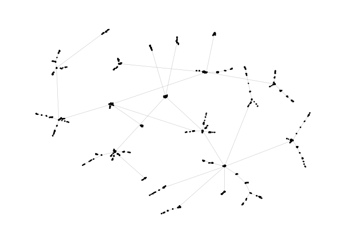
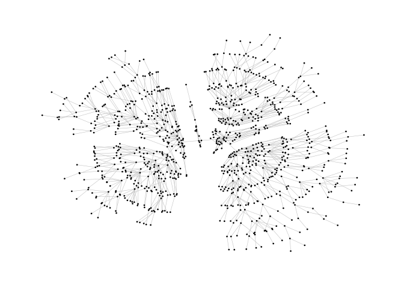
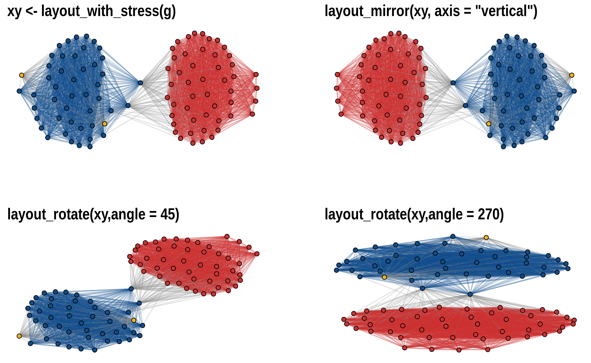
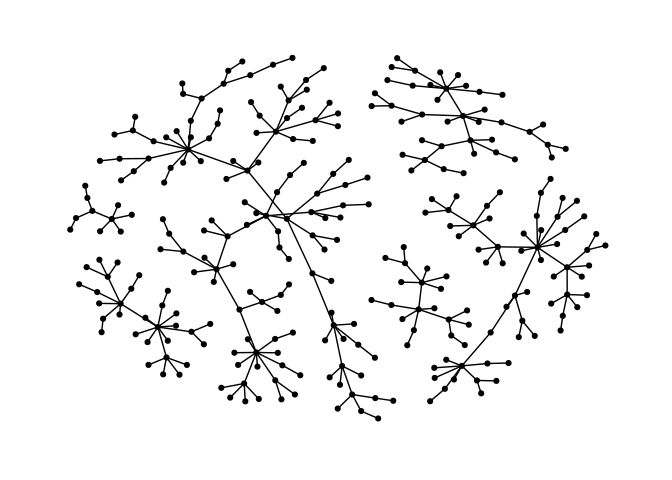
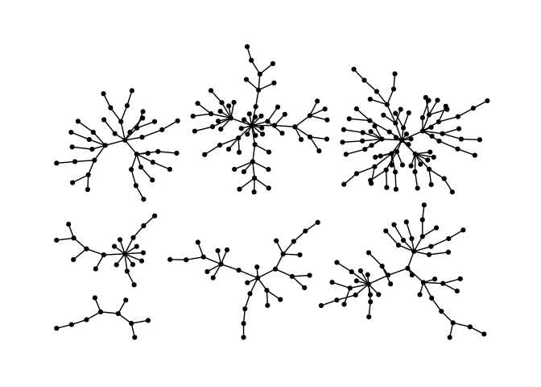
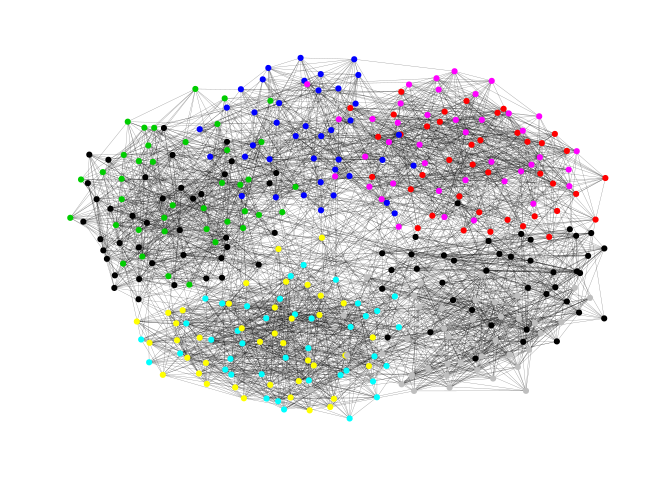
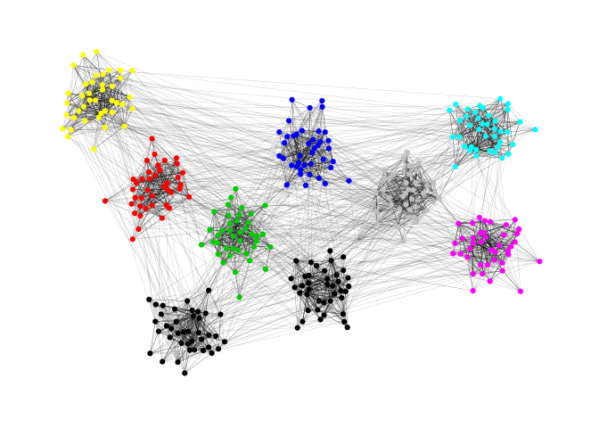

<!-- README.md is generated from README.Rmd. Please edit that file -->
smglr
=====

[](https://travis-ci.org/schochastics/smglr)
[](https://ci.appveyor.com/project/schochastics/smglr)

smglr stands for **S**tress **M**ajorization **G**raph **L**ayout in R.
The package implements some graph layout algorithms that are not
available in `igraph`. See my [blog
post](http://blog.schochastics.net/post/stress-based-graph-layouts/) for
an introduction on stress majorization.

So far, the package implements two algorithms:

-   Stress majorization
    ([Paper](https://graphviz.gitlab.io/_pages/Documentation/GKN04.pdf))
-   Quadrilateral backbone layout
    ([Paper](http://jgaa.info/accepted/2015/NocajOrtmannBrandes2015.19.2.pdf))

Stress Majorization: Connected Network
--------------------------------------

*This example is a bit of a special case since it exploits some weird
issues in igraph.*

``` r
library(igraph)   
library(ggraph)   
# devtools::install_github("schochastics/smglr")
library(smglr)

set.seed(666)
pa <- sample_pa(1000,1,1,directed = F)

ggraph(pa)+
  geom_edge_link(width=0.2,colour="grey")+
  geom_node_point(col="black",size=0.3)+
  theme_graph()
```



``` r


l <- layout_with_stress(pa)
ggraph(pa,layout="manual",node.positions=data.frame(x=l[,1],y=l[,2]))+
  geom_edge_link(width=0.2,colour="grey")+
  geom_node_point(col="black",size=0.3)+
  theme_graph()
```



Layout manipulation
-------------------

The functions `layout_mirror()` and `layout_rotate()` can be used to
manipulate an existing layout



Stress Majorization: Unconnected Network
----------------------------------------

Stress majorization also works for networks with several components. It
relies on a bin packing algorithm to efficiently put the components in a
rectangle, rather than a circle.

``` r
set.seed(666)
g <- disjoint_union(
  sample_pa(10,directed = F),
  sample_pa(20,directed = F),
  sample_pa(30,directed = F),
  sample_pa(40,directed = F),
  sample_pa(50,directed = F),
  sample_pa(60,directed = F),
  sample_pa(80,directed = F)
)

ggraph(g) +
  geom_edge_link() +
  geom_node_point() +
  theme_graph()
```



``` r

l <- layout_with_stress(g,bbox=30)
ggraph(g, layout="manual", node.positions=data.frame(x=l[,1],y=l[,2])) +
  geom_edge_link() +
  geom_node_point() +
  theme_graph()
```



Backbone Layout
---------------

Backbone layouts are helpful for drawing hairballs like below

``` r
set.seed(665)
g <- sample_islands(9,40,0.4,15)
g <- simplify(g)

xy <- layout_with_stress(g)
ggraph(g,layout="manual",node.positions=data.frame(x=xy[,1],y=xy[,2]))+
  geom_edge_link(colour=rgb(0,0,0,0.5),width=0.1)+
  geom_node_point(col=rep(1:9,each=40))+
  theme_graph()
```



The backbone layout helps to uncover potential group structures based on
edge embeddedness and puts more emphasis on this structure in the
layout.

``` r
bb <- backbone_layout(g,keep=0.4)
E(g)$col <- F
E(g)$col[bb$backbone] <- T

ggraph(g,layout="manual",node.positions=data.frame(x=bb$xy[,1],y=bb$xy[,2]))+
  geom_edge_link(aes(col=col),width=0.1)+
  geom_node_point(col=rep(1:9,each=40))+
  scale_edge_color_manual(values=c(rgb(0,0,0,0.3),rgb(0,0,0,1)))+
  theme_graph()+
  theme(legend.position ="none")
```


