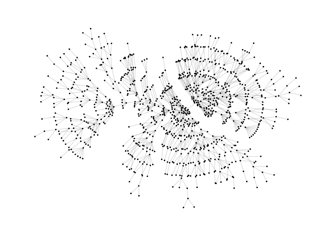
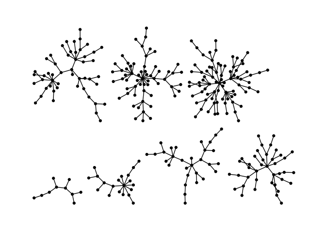
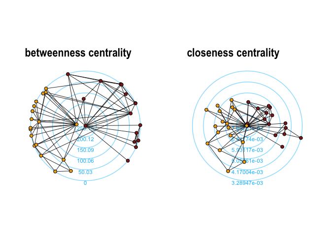

<!-- README.md is generated from README.Rmd. Please edit that file -->

# graphlayouts

[](https://travis-ci.org/schochastics/graphlayouts)
[](https://ci.appveyor.com/project/schochastics/smglr)
[](https://cran.r-project.org/package=graphlayouts)
[](https://www.tidyverse.org/lifecycle/#maturing)
[](https://CRAN.R-project.org/package=graphlayouts)

This package implements some graph layout algorithms that are not
available in `igraph`. See my [blog
post](http://blog.schochastics.net/post/stress-based-graph-layouts/) for
an introduction on stress majorization.

So far, the package implements four algorithms:

  - Stress majorization
    ([Paper](https://graphviz.gitlab.io/_pages/Documentation/GKN04.pdf))
  - Quadrilateral backbone layout
    ([Paper](http://jgaa.info/accepted/2015/NocajOrtmannBrandes2015.19.2.pdf))
  - flexible radial layouts
    ([Paper](http://jgaa.info/accepted/2011/BrandesPich2011.15.1.pdf))
  - spectral layouts

## Install

``` r
# dev version
remotes::install_github("schochastics/graphlayouts")

#CRAN
install.packages("graphlayouts")
```

## Stress Majorization: Connected Network

*This example is a bit of a special case since it exploits some weird
issues in igraph.*

``` r
library(igraph)   
library(ggraph)   
library(graphlayouts)

set.seed(666)
pa <- sample_pa(1000,1,1,directed = F)

ggraph(pa)+
  geom_edge_link(width=0.2,colour="grey")+
  geom_node_point(col="black",size=0.3)+
  theme_graph()
```


``` r

ggraph(pa,layout="stress")+
  geom_edge_link(width=0.2,colour="grey")+
  geom_node_point(col="black",size=0.3)+
  theme_graph()
```



## Layout manipulation

The functions `layout_mirror()` and `layout_rotate()` can be used to
manipulate an existing
layout


## Stress Majorization: Unconnected Network

Stress majorization also works for networks with several components. It
relies on a bin packing algorithm to efficiently put the components in a
rectangle, rather than a circle.

``` r
set.seed(666)
g <- disjoint_union(
  sample_pa(10,directed = F),
  sample_pa(20,directed = F),
  sample_pa(30,directed = F),
  sample_pa(40,directed = F),
  sample_pa(50,directed = F),
  sample_pa(60,directed = F),
  sample_pa(80,directed = F)
)

ggraph(g) +
  geom_edge_link() +
  geom_node_point() +
  theme_graph()
```


``` r

ggraph(g, layout="stress") +
  geom_edge_link() +
  geom_node_point() +
  theme_graph()
```



## Backbone Layout

Backbone layouts are helpful for drawing hairballs.

``` r
set.seed(665)
#create network with a group structure
g <- sample_islands(9,40,0.4,15)
g <- simplify(g)
V(g)$grp <- as.character(rep(1:9,each=40))

ggraph(g,layout="stress")+
  geom_edge_link(colour=rgb(0,0,0,0.5),width=0.1)+
  geom_node_point(aes(col=grp))+
  scale_color_brewer(palette = "Set1")+
  theme_graph()+
  theme(legend.position = "none")
```


The backbone layout helps to uncover potential group structures based on
edge embeddedness and puts more emphasis on this structure in the
layout.

``` r
bb <- layout_as_backbone(g,keep=0.4)
E(g)$col <- F
E(g)$col[bb$backbone] <- T

ggraph(g,layout="manual",node.positions=data.frame(x=bb$xy[,1],y=bb$xy[,2]))+
  geom_edge_link(aes(col=col),width=0.1)+
  geom_node_point(aes(col=grp))+
  scale_color_brewer(palette = "Set1")+
  scale_edge_color_manual(values=c(rgb(0,0,0,0.3),rgb(0,0,0,1)))+
  theme_graph()+
  theme(legend.position = "none")
```


## Radial Layout with Focal Node

The function `layout_with_focus` creates a radial layout around a focal
node. All nodes with the same distance from the focal node are on the
same circle.

``` r
library(igraphdata)
library(patchwork)
data("karate")

p1 <- ggraph(karate,layout = "focus",v = 1) +
  draw_circle(use = "focus",max.circle = 3)+
  geom_edge_link(edge_color="black",edge_width=0.3)+
  geom_node_point(aes(fill=as.factor(Faction)),size=2,shape=21)+
  scale_fill_manual(values=c("#8B2323", "#EEAD0E"))+
  theme_graph()+
  theme(legend.position = "none")+
  coord_fixed()+
  labs(title= "Focus on Mr. Hi")

p2 <- ggraph(karate,layout = "focus",v = 34) +
  draw_circle(use = "focus",max.circle = 4)+
  geom_edge_link(edge_color="black",edge_width=0.3)+
  geom_node_point(aes(fill=as.factor(Faction)),size=2,shape=21)+
  scale_fill_manual(values=c("#8B2323", "#EEAD0E"))+
  theme_graph()+
  theme(legend.position = "none")+
  coord_fixed()+
  labs(title= "Focus on John A.")

p1+p2
```


## Radial Centrality Layout

The function `layout_with_centrality` creates a radial layout around the
node with the highest centrality value. The further outside a node is,
the more peripheral it is.

``` r

bc <- betweenness(karate)
p1 <- ggraph(karate,layout = "centrality", cent = bc, tseq = seq(0,1,0.15)) +
  draw_circle(use = "cent") +
  annotate_circle(bc,format="",pos="bottom") +
  geom_edge_link(edge_color="black",edge_width=0.3)+
  geom_node_point(aes(fill=as.factor(Faction)),size=2,shape=21)+
  scale_fill_manual(values=c("#8B2323", "#EEAD0E"))+
  theme_graph()+
  theme(legend.position = "none")+
  coord_fixed()+
  labs(title="betweenness centrality")


cc <- closeness(karate)
p2 <- ggraph(karate,layout = "centrality", cent = cc, tseq = seq(0,1,0.2)) +
  draw_circle(use = "cent") +
  annotate_circle(cc,format="scientific",pos="bottom") +
  geom_edge_link(edge_color="black",edge_width=0.3)+
  geom_node_point(aes(fill=as.factor(Faction)),size=2,shape=21)+
  scale_fill_manual(values=c("#8B2323", "#EEAD0E"))+
  theme_graph()+
  theme(legend.position = "none")+
  coord_fixed()+
  labs(title="closeness centrality")

p1+p2
```


